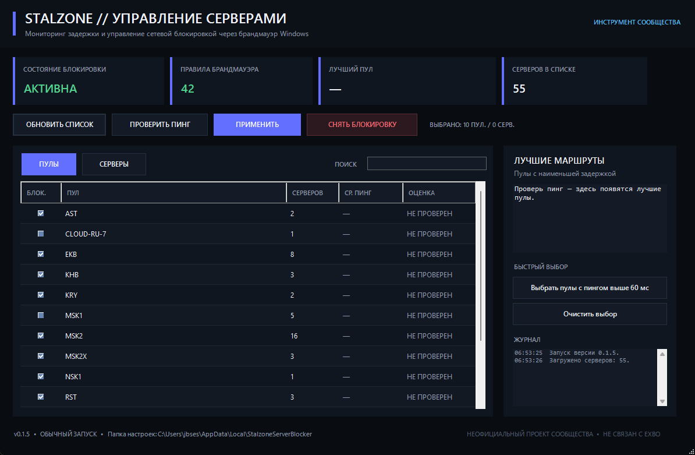

# STALZONE // SERVER BLOCKER

**STALZONE Server Blocker** — неофициальный Windows-инструмент для просмотра задержки до серверных пулов STALZONE / STALCRAFT и выборочной блокировки нежелательных серверов через стандартный брандмауэр Windows.



> [!IMPORTANT]
> Проект не связан с EXBO и не является официальным инструментом STALZONE / STALCRAFT. Выборочная блокировка игровых серверов может противоречить правилам игры. Используйте на свой риск.

## Возможности

- получение списка серверов и пулов;
- проверка пинга до серверов;
- средний пинг по пулу;
- блокировка целого пула или отдельного сервера;
- отображение лучших маршрутов по задержке;
- быстрый выбор пулов с высоким пингом;
- поиск по пулу, серверу и IP;
- применение правил через стандартный Windows Defender Firewall;
- запрос прав администратора только при изменении правил брандмауэра;
- безопасный резервный источник списка серверов при проблемах TLS основного endpoint;
- CLI-режим для продвинутых пользователей.

## Требования

- Windows 10 или Windows 11;
- Windows PowerShell 5.1+;
- Windows Defender Firewall / служба брандмауэра Windows.

Дополнительные программы и драйверы не нужны.

## Установка и запуск

1. Откройте раздел **Releases** этого репозитория.
2. Скачайте `STALZONE-Server-Blocker-v0.1.6.zip`.
3. Распакуйте архив в любую папку.
4. Запустите:

```text
Start-Blocker.cmd
```

5. Нажмите **Обновить список**.
6. Нажмите **Проверить пинг**.
7. Отметьте нежелательные пулы или отдельные серверы.
8. Нажмите **Применить** и подтвердите стандартный запрос UAC Windows.

Если игра уже запущена, после изменения правил рекомендуется переподключиться или перезапустить её.

## Как это работает

Программа не внедряется в процесс игры и не меняет файлы клиента. Для выбранных IP создаются исходящие правила Windows Firewall:

```text
Direction: Outbound
Action:    Block
Group:     STALZONE Server Blocker
```

При нажатии **Снять блокировку** удаляются только правила, созданные этим приложением.

## Пулы и отдельные серверы

На вкладке **Пулы** можно заблокировать сразу целую группу серверов, например:

```text
MSK2
EKB
KHB
```

На вкладке **Серверы** можно заблокировать конкретный адрес, не отключая весь пул.

Блокировщик не задаёт серверу приоритет — он только запрещает подключения к выбранным IP.

## Пинг

Пинг измеряется через ICMP. Цветовая оценка:

- до 30 мс — **отлично**;
- 31–60 мс — **нормально**;
- выше 60 мс — **высокий**.

Если отображается `Н/Д`, сервер мог просто отключить ответы ICMP. Это не обязательно означает, что сервер недоступен для игры.

## Источники списка серверов

Основной endpoint:

```text
https://backend.stalcraftx.ru/address_list
```

Резервный публичный список:

```text
https://raw.githubusercontent.com/clovexx/sz-server-blocker/master/tunnels.txt
```

Если Windows не доверяет TLS-сертификату основного endpoint, приложение **не отключает проверку сертификата**, а использует резервный источник.

## Конфиденциальность

Программа не запрашивает и не сохраняет:

- логин EXBO;
- пароль;
- токены;
- Steam ID;
- данные игрового аккаунта.

Локально сохраняются только выбранные пулы/серверы и кэш списка:

```text
%LOCALAPPDATA%\StalzoneServerBlocker
```

## Безопасность

Используются стандартные средства Windows и PowerShell:

- `Invoke-RestMethod`;
- `Invoke-WebRequest`;
- `System.Net.NetworkInformation.Ping`;
- `Get-NetFirewallRule`;
- `New-NetFirewallRule`;
- `Remove-NetFirewallRule`;
- Windows Forms.

Приложение не использует DLL-инъекции, драйверы, модификацию памяти игры или отключение проверки TLS.

Подробнее: [SECURITY.md](SECURITY.md).

## CLI

Показать GUI:

```powershell
.\stalzone-server-blocker.ps1
```

Обновить список:

```powershell
.\stalzone-server-blocker.ps1 -Command sync
```

Показать список:

```powershell
.\stalzone-server-blocker.ps1 -Command list
```

Проверить пинг:

```powershell
.\stalzone-server-blocker.ps1 -Command ping
```

Выбрать пулы:

```powershell
.\stalzone-server-blocker.ps1 -BlockPool "MSK2","EKB"
```

Применить правила из PowerShell от администратора:

```powershell
.\stalzone-server-blocker.ps1 -Command apply
```

Удалить правила:

```powershell
.\stalzone-server-blocker.ps1 -Command clear
```

Проверить статус:

```powershell
.\stalzone-server-blocker.ps1 -Command status
```

## Контакты

- Discord: `cyberseparatism`
- Telegram: `@cyberseparatism`

## Благодарности

Идея вдохновлена Linux-проектом [`clovexx/sz-server-blocker`](https://github.com/clovexx/sz-server-blocker).

## Участие в разработке

Баг-репорты и предложения приветствуются. Перед Pull Request прочитайте [CONTRIBUTING.md](CONTRIBUTING.md).

## Лицензия

MIT — см. [LICENSE](LICENSE).
